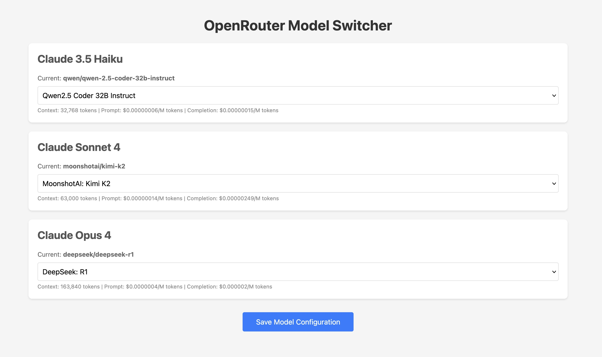

# CCORP - Anthropic to OpenAI/OpenRouter Adapter

## Use Claude Code Cli with any OpenRouter model.

CCORP (Claude Code OpenRouter Proxy) is a high-performance Rust application that acts as an adapter between the Anthropic API format and the OpenAI/OpenRouter API format. It provides a seamless bridge for applications expecting Anthropic's API to work with OpenRouter's extensive model collection.

## Features

- **API Translation**: Converts Anthropic API requests to OpenAI/OpenRouter format and vice versa
- **Streaming Support**: Full support for both streaming and non-streaming API calls
- **Model Mapping**: Flexible configuration to map Claude models to any OpenRouter-supported model
- **Web UI**: Built-in web interface for easy model switching at runtime
- **Request Logging**: Optional logging of all requests and responses for debugging

## Installation



### Via Cargo

#### Prerequisites

- Rust and Cargo: [https://www.rust-lang.org/tools/install](https://www.rust-lang.org/tools/install)

```bash
cargo install --git https://github.com/terhechte/CCORP --bin ccor
```

### Via Releases

Download the latest binary from the [releases page](https://github.com/terhechte/CCORP/releases).

#### Note macOS Users:

After downloading the binary you need to remove the gatekeeper quarantine attribute:

```bash
xattr -r -d com.apple.quarantine ccor
```

## Configuration

### Step 1: Environment Setup

Create a `.env` file in the root directory with your OpenRouter API key:

```env
OPENROUTER_API_KEY=your_openrouter_api_key_here
```

### Step 2: Model Configuration

Create a `config.json` file to configure the port and model mappings:

```json
{
  "port": 3000,
  "models": {
    "haiku": "qwen/qwen-2.5-coder-32b-instruct",
    "sonnet": "moonshotai/kimi-k2",
    "opus": "deepseek/deepseek-r1"
  }
}
```

You can map Claude models to any model available on OpenRouter.

## Running the Application

### Basic Usage

```bash
cargo run
```

The server will start on `0.0.0.0:3000` (or the port specified in `config.json`).

### With Request Logging

To enable logging of all requests and responses:

```bash
cargo run -- --logging logs
```

This creates timestamped JSON files in the `logs` directory for each request/response pair.

## Using with Claude Code CLI

CCORP is designed to work seamlessly with Anthropic's Claude Code CLI:

1. Start CCORP (it will run on port 3000 by default)
2. Set environment variables:

   ```bash
   export ANTHROPIC_BASE_URL=http://localhost:3000
   export ANTHROPIC_AUTH_TOKEN="your_openrouter_api_key"
   ```

3. Run Claude Code as normal:

   ```bash
   claude
   ```

## Web UI for Model Management

CCORP includes a web interface for dynamically switching models without restarting the server.

Visit `http://localhost:3000/switch-model` in your browser to:

- View all available OpenRouter models
- Change model mappings for Haiku, Sonnet, and Opus

Changes are saved to `config.json` and take effect immediately.

## Development

### Building

```bash
cargo build --release
```

### Running Tests

```bash
cargo test
```

### Contributing

Contributions are welcome! Please feel free to submit a Pull Request.

## License

CCORP is licensed under the MIT License. See [LICENSE](LICENSE) for details.
